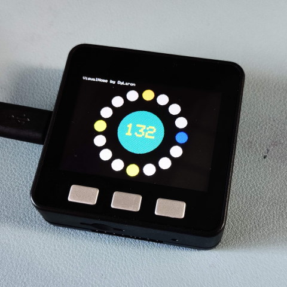

# A metronome app on ESP32 M5Stack.
This is based on my other earlier application on an arduino with NeoPixel LED Ring.

# Features
- Short press the middle button to start / stop.
- An indicator runs around the ring every measure / bar (4 beats).
- Whole ring flashes on every beat. Downbeat or upbeat configurable.
- First beat accented (stronger flash, higher buzz tone)
- Left and Right buttons to adjust the BPM on the fly.
- 'tap to set BPM' by long press the middle button when stopped. Metronome starts automatically after 5 taps.

# Bill of material
- An M5Stack Core (or Core 2)

# How to use the code?
- The easist way is to use VS Code with PlatformIO extension. The platformio.ini will take charge of the project.
- src/main.cpp is the main program to compile and load to the microcontroller
- Change the variables in the definitions as you wish

https://www.instagram.com/p/CPMX3MvpxEf/?utm_source=ig_web_copy_link